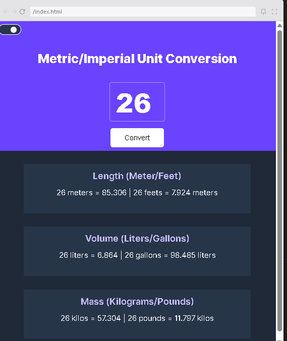
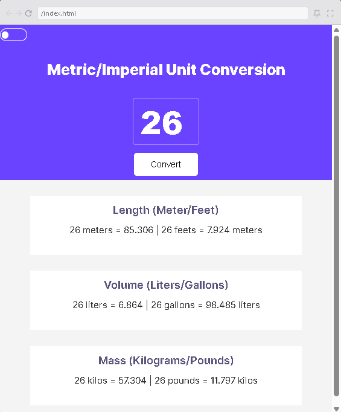

# Unit Converter
A simple web application that allows users to convert between metric and imperial units for length, volume, and mass. The app also includes a toggleable dark mode for better user experience.

  
  

## Technologies Used
- HTML
- CSS
- JavaScript

## How to Run
1. Clone the repository and run index.html
2. click on this [link](https://unittconvert.netlify.app/)
